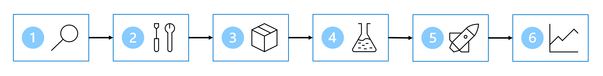

# Designing a ML solution

The general six steps of developing a ML model are:

1. Define the problem
2. Get the data
3. Prepare the data
4. Train the model
5. Integrate the model
6. Monitor the model

## Data source

Identify where the data you want to use is stored. This may be a SQL database, in a CRM system or generated by IoT
devices.

## Data format

The format of the data and the required format for the ML model may vary. Types of data include:

- Tabular or structured (Excel, CSV)
- Semi-structured data (IoT generated JSON)
- Unstructured data (Documents, images, audio, video)

## Desired data format

The input data may require transformation before used as input to the ML model.
An example may be a IoT device creating JSON data. This may be then transformed to a structured table format, and then
transformed the data to add or extract additional important features.

## Store data

Storing data for model training can be done in one of the three services:

- Azure Blob Storage
- Azure Data Lake Storage
- Azure SQL Database

## Creating a data ingestion pipeline

Use **Synapse Analytics**, **Databricks** or **Machine Learning** functions in Azure to create a data ingestion
pipeline. Data ingestion includes transforming large amounts of data, to extract, transform and store the data in
preparation for training the ML model.

For example, a common approach for a data ingestion pipeline is:

1. Extract raw data from its source
2. Copy and transform the data with Azure Synapse Analytics
3. Store the prepared data in an Azure Blob Storage
4. Train the model with Azure Machine Learning

