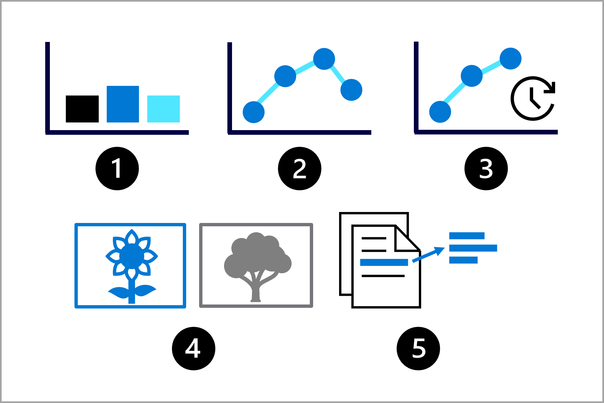

# Designing a ML model for training

For our ML model we need to consider which problem we want to solve:

- What should be the model's output?
- What type of ML task can we use?
- Which metrics should we use?

Common ML tasks are:

1. Classification
2. Regression
3. Time-series forecasting
4. Computer vision
5. NLP

## Selecting a ML service in Azure

Commonly used services in Azure to train ML models are:

- Azure ML
    - Can be managed with Python SDK
- Azure Databricks
    - Uses Spark
- Azure Synapse Analytics
    - Used for big data analytics, primarily for ingestion and transformation
- Azure AI Services
    - Collection of prebuilt ML models for common ML tasks

Some guidelines on selecting the _correct_ service:

- Use Azure AI Services whenever one of the customizable prebuilt models suits your requirements, to save time and
  effort.
- Use Azure Synapse Analytics or Azure Databricks if you want to keep all data-related (data engineering and data
  science) projects within the same service.
- Use Azure Synapse Analytics or Azure Databricks if you need distributed compute for working with large datasets (
  datasets are large when you experience capacity constraints with standard compute). You'll need to work with PySpark
  to use the distributed compute.
- Use Azure Machine Learning or Azure Databricks when you want full control over model training and management.
- Use Azure Machine Learning when Python is your preferred programming language.
- Use Azure Machine Learning when you want an intuitive user interface to manage your machine learning lifecycle.

## Selecting computing resources

For large amounts of tabular data, it may be beneficial to use **GPUs**, but come at a higher cost than **CPUs**. For
smaller datasets, CPU will be sufficient and is cheap to use.
Regarding virtual machine sizes, use one of the following:

- General purpuse: Balanced CPU-to-memory ratio. (testing/development, small datasets)
- Memory optimized: High memory-to-CPU ratio. (large datasets, in-memory analytics, notebooks)

### Spark

Services like Azure Synapse Analytics and Azure Databricks offer Spark compute. Spark compute or clusters use the same
sizing as virtual machines in Azure but distribute the workloads.

A Spark cluster consists of a driver node and worker nodes. Your code will initially communicate with the driver node.
The work is then distributed across the worker nodes. When you use a service that distributes the work, parts of the
workload can be executed in parallel, reducing the processing time. Finally, the work is summarized and the driver node
communicates the result back to you.

